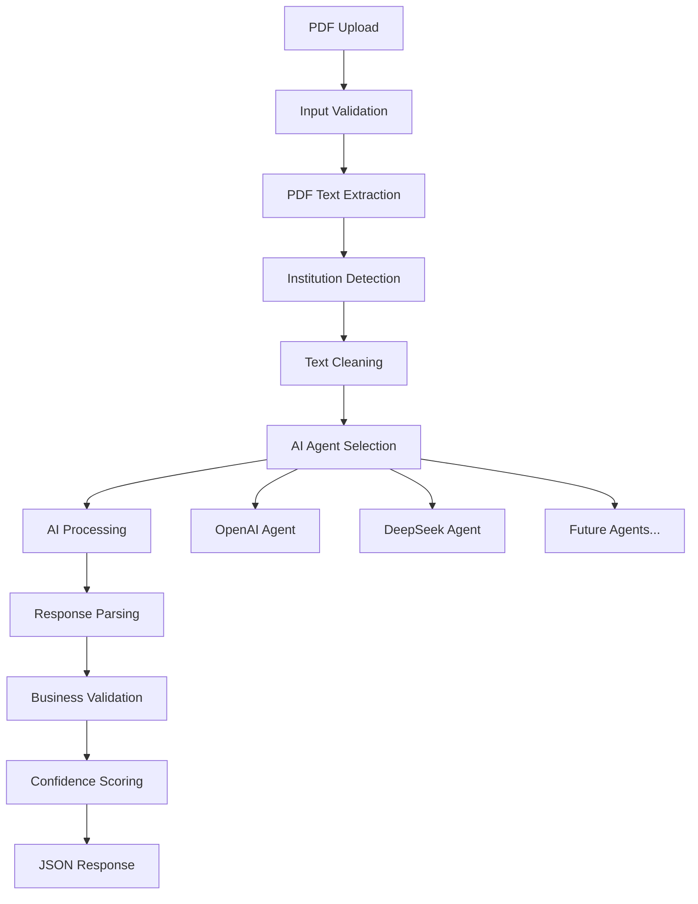

# 🏗️ Arquitetura do AI Invoice Agent

> **Design patterns e decisões arquiteturais para agentes de IA**

## 📖 Visão Arquitetural

Este microserviço implementa **agentes de IA especializados** para extração de dados financeiros, usando padrões arquiteturais modernos que facilitam extensibilidade e manutenção.

### **Design Principles**

- **Single Responsibility**: Cada classe tem uma responsabilidade clara
- **Strategy Pattern**: Múltiplos providers AI intercambiáveis
- **Factory Pattern**: Criação centralizada de providers
- **Separation of Concerns**: Camadas bem definidas
- **Stateless**: Sem persistência local, cloud-ready

## 🏛️ Arquitetura Geral

### **Padrão Arquitetural: Service API**

```
┌─────────────────┐    ┌─────────────────┐    ┌─────────────────┐
│   FastAPI       │    │  Core Business  │    │   AI Agents     │
│   Routes        │───▶│   Logic         │───▶│   (Strategy)    │
│   (main.py)     │    │  (extractor.py) │    │   (providers/)  │
└─────────────────┘    └─────────────────┘    └─────────────────┘
         │                       │                       │
         ▼                       ▼                       ▼
┌─────────────────┐    ┌─────────────────┐    ┌─────────────────┐
│   Input/Output  │    │   Utilities     │    │   Data Models   │
│   Validation    │    │   (utils.py)    │    │   (models.py)   │
│   Error Handle  │    │   PDF + Valid   │    │   Pydantic      │
└─────────────────┘    └─────────────────┘    └─────────────────┘
```

## 🔄 Fluxo de Dados

### **Processing Pipeline**



### **Data Flow Details**

1. **Input**: PDF bytes + optional provider
2. **Processing**: Text extraction → Institution detection → AI processing
3. **Validation**: Business rules + confidence scoring
4. **Output**: Structured transactions + metadata

## 🎭 Design Patterns

### **1. Strategy Pattern - AI Providers**

**Interface Comum**:

```python
class AIProvider(ABC):
    @abstractmethod
    async def extract_transactions(self, text: str, institution: str) -> Tuple[...]:
        pass

    @property
    @abstractmethod
    def name(self) -> str:
        pass
```

**Implementações Concretas**:

- `OpenAIProvider`: GPT-4o-mini, structured output
- `DeepSeekProvider`: Custom parsing, retry logic
- _Extensível_: Claude, Gemini, modelos locais

**Benefícios**:

- ✅ Runtime provider selection
- ✅ Easy testing com mocks
- ✅ Adição de novos providers sem breaking changes
- ✅ Configuração específica por provider

### **2. Factory Pattern - Provider Creation**

```python
def create_provider(name: str, **kwargs) -> AIProvider:
    if name not in PROVIDERS:
        raise ValueError(f"Unknown provider '{name}'")
    return PROVIDERS[name](**kwargs)
```

**Benefícios**:

- ✅ Validação centralizada
- ✅ Dependency injection
- ✅ Easy mocking para testes
- ✅ Configuration isolation

### **3. Template Method - Institution Processing**

**Base Structure**:

```python
def _clean_text_by_institution(self, text: str, institution: str) -> str:
    # 1. Get institution config
    # 2. Apply specific cleaning rules
    # 3. Preserve important sections
    # 4. Remove noise patterns
```

**Institution-Specific Configs**:

- CAIXA: Preserve "RESUMO", "LANÇAMENTOS"
- NUBANK: Compact format, single-line transactions
- BANCO DO BRASIL: Structured sections
- GENERIC: Fallback rules

## 📊 Camadas Arquiteturais

### **Presentation Layer (main.py)**

**Responsabilidades**:

- HTTP request/response handling
- Input validation (file type, size)
- Provider selection logic
- Error handling e status codes
- CORS e security headers

**Decisão**: Todas as rotas em um arquivo

- ✅ Simplicidade para microserviço pequeno
- ✅ Fácil navegação e debugging
- ✅ Menos overhead de imports
- ❌ Tradeoff: arquivo pode crescer

### **Business Logic Layer (extractor.py)**

**Responsabilidades**:

- Orquestração do processo completo
- Provider integration
- Metadata collection
- Error handling centralizado

**Pattern**: Facade + Orchestrator

- Simplifica interface externa
- Coordena multiple subsystems
- Centraliza business rules

### **Utilities Layer (utils.py)**

**Responsabilidades**:

- PDF processing (PyMuPDF + OCR fallback)
- Institution detection
- Text cleaning e preprocessing
- Business validation rules

**Pattern**: Utility Classes

- Stateless operations
- Single responsibility por classe
- Easy unit testing

### **Data Layer (models.py)**

**Responsabilidades**:

- Request/response models
- Data validation
- Type safety
- Serialization

**Pattern**: Data Transfer Objects (DTOs)

- Pydantic validation
- Type hints enforced
- API contract definition

## 🤖 AI Agents Architecture

### **Provider Comparison**

| Aspect        | OpenAI            | DeepSeek      | Design Impact                   |
| ------------- | ----------------- | ------------- | ------------------------------- |
| **Model**     | GPT-4o-mini       | deepseek-chat | Different prompt strategies     |
| **Output**    | Structured JSON   | Text parsing  | Different response handling     |
| **Cost**      | ~$0.15/1M         | ~$0.27/1M     | Cost-based selection logic      |
| **Strengths** | Brazilian context | Multilingual  | Provider-specific optimizations |

### **Provider Selection Logic**

```python
# Runtime selection
selected_provider = provider or DEFAULT_AI_PROVIDER

# Fallback strategy (future)
for provider_name in [selected_provider, "openai", "deepseek"]:
    try:
        return await self._try_provider(provider_name)
    except Exception:
        continue
```

### **Prompt Engineering Strategy**

**Institution-Specific Prompts**:

- Base prompt + institution rules
- Provider-specific adjustments
- Temperature e token limits otimizados

**Benefits**:

- Improved accuracy por contexto
- Token optimization
- Consistent output format

## 🏦 Institution Detection & Processing

### **Detection Strategy**

```python
def _detect_institution(self, text: str) -> str:
    # Priority-based detection
    # 1. Exact matches (CARTÕES CAIXA)
    # 2. Partial matches (NUBANK)
    # 3. Fallback (GENERIC)
```

### **Processing Configs**

```python
INSTITUTION_CONFIGS = {
    "CAIXA": {
        "preserve_sections": ["RESUMO", "LANÇAMENTOS"],
        "remove_patterns": [r"^CENTRAL.*", r"^SAC.*"],
        "value_format": "ends_with_D_or_C"
    }
}
```

**Benefits**:

- Consistent processing por instituição
- Easy addition de novas instituições
- Configurable without code changes

## ✅ Validation Architecture

### **Multi-Layer Validation**

**1. Input Validation (FastAPI level)**:

- File type, size limits
- Provider name validation
- Request format validation

**2. Business Validation (Domain level)**:

- Transaction field requirements
- Date consistency checks
- Amount range validation
- Sum reconciliation

**3. Confidence Scoring**:

```python
confidence = passed_validations / total_validations
```

### **Validation Rules Design**

- **Modular**: Each rule independent
- **Configurable**: Thresholds adjustable
- **Extensible**: Easy to add new rules
- **Reportable**: Detailed error messages

## 🔌 Extensibility Points

### **1. Adding New AI Provider**

```python
# 1. Implement AIProvider interface
# 2. Register in PROVIDERS dict
# 3. Configure prompts
# 4. Add tests
```

### **2. Adding New Institution**

```python
# 1. Add detection pattern
# 2. Configure processing rules
# 3. Add institution prompts
# 4. Test with sample PDFs
```

### **3. Adding New Validation Rule**

```python
# 1. Implement validation method
# 2. Add to validation pipeline
# 3. Configure thresholds
# 4. Add error messages
```

## 📈 Performance Architecture

### **Optimization Strategies**

- **Text Truncation**: 8KB limit para AI APIs
- **OCR Fallback**: Only when PyMuPDF fails
- **Async Processing**: Non-blocking I/O
- **Connection Pooling**: HTTP client reuse
- **Memory Management**: No file persistence

### **Scalability Design**

- **Stateless**: Easy horizontal scaling
- **Container-Ready**: Docker + K8s support
- **Health Checks**: Liveness + readiness
- **Graceful Degradation**: Provider fallbacks

## 🎓 Architectural Decisions Record (ADR)

### **ADR-001: Service API over Layered Architecture**

**Decision**: Single service com strategy pattern vs múltiplas camadas
**Rationale**: Simplicidade, performance, easy testing
**Consequences**: Tradeoff complexity vs maintainability

### **ADR-002: All Routes in main.py**

**Decision**: Consolidar todas as rotas em um arquivo
**Rationale**: Microserviço pequeno, easy navigation
**Consequences**: File growth vs simplicity

### **ADR-003: Strategy Pattern for AI Providers**

**Decision**: Abstract interface + concrete implementations
**Rationale**: Multiple providers, runtime selection, extensibility
**Consequences**: More abstraction vs flexibility

### **ADR-004: Institution-Specific Processing**

**Decision**: Detect institution + apply specific rules
**Rationale**: Different bank formats, accuracy improvement
**Consequences**: More complexity vs better results

---

Esta arquitetura balanceia **simplicidade** com **extensibilidade**, criando uma base sólida para evolução do sistema de agentes de IA financeiros.
